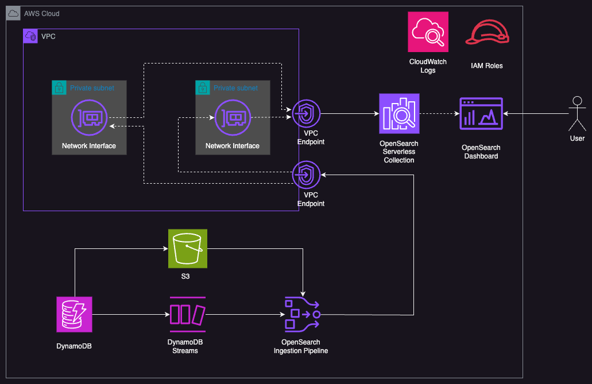

# Amazon DynamoDB zero-ETL integration with Amazon OpenSearch Service using AWS CDK

This code repository is associated with the [following](https://medium.com/@maxtybar/amazon-dynamodb-zero-etl-integration-with-amazon-opensearch-service-with-amazon-opensearch-and-cdk-7b1c8bdd45da) Medium post.

# Architecture



# Prerequisites

Deployment has been tested on MacOS and Linux machines. Installation guide assumes you have AWS account and Administrator Access to provision all the resources. 
Provisioning will take somewhere from 8 to 10 minutes.

=============

* [node](https://docs.npmjs.com/downloading-and-installing-node-js-and-npm) >= 16.0.0
* [npm](https://docs.npmjs.com/downloading-and-installing-node-js-and-npm) >= 8.0.0
* [AWS CLI](https://docs.aws.amazon.com/cli/latest/userguide/getting-started-install.html) >= 2.0.0
* [AWS CDK](https://docs.aws.amazon.com/cdk/v2/guide/getting_started.html) >= 2.66.1

# Installation

Clone current repo. From within the root project folder (``opensearch-dynamodb-etl-cdk``), run the following commands:

```
npm install
```
Note - if you have `npm ERR!` erros related to overlapping dependencies, run `npm install --force`.

```
cdk bootstrap
```

```
cdk deploy -c UserArn=$(aws sts get-caller-identity --query Arn --output text) --require-approval never
```

# How to delete

From within the root project folder (``opensearch-dynamodb-etl-cdk``), run the following command:

```
cdk destroy --force
```